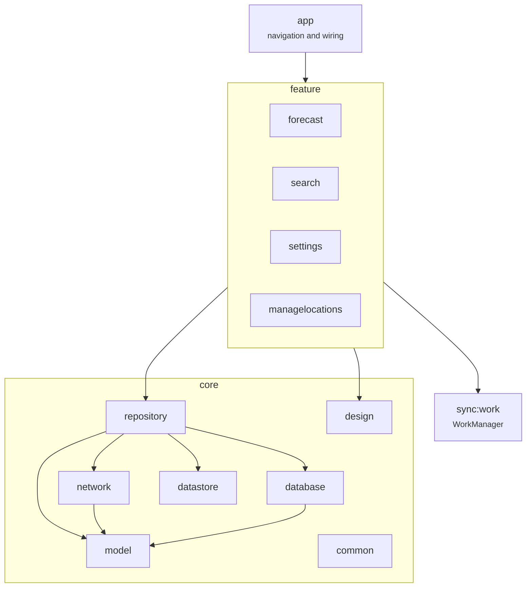

# MyWeather - developer documentation

An offline-first Android weather app. Multi-module, Compose, Room, Ktor, WorkManager, and a
`build-logic` included build carrying the convention plugins.

## Table of contents

- [Tech stack](#tech-stack)
- [Module graph](#module-graph)
- [How data flows](#how-data-flows)
- [The toolchain](#the-toolchain)
- [Network](#network)
- [Background sync](#background-sync)
- [Building](#building)
- [Testing](#testing)
- [Continuous integration](#continuous-integration)
- [Conventions and traps](#conventions-and-traps)
- [Known gaps](#known-gaps)

## Tech stack

| Layer | Choice |
|---|---|
| Language | Kotlin 2.3.10 |
| Build | AGP 9.2.1 on Gradle 9.4.1, version catalogue, convention plugins in `build-logic` |
| UI | Jetpack Compose |
| HTTP | Ktor with the Android engine, kotlinx.serialization |
| Storage | Room for weather, DataStore for settings |
| Background | WorkManager |
| Injection | Dagger Hilt with KSP |
| Static analysis | Detekt (`config/detekt/config.yml`) and Kotlinter |
| API | [Open-Meteo](https://open-meteo.com), no key required |

## Module graph



`build-logic` is an included build, not a module. It holds the convention plugins that every
`build.gradle.kts` applies (`weather.android.library`, `weather.android.compose.library` and
friends), which is why the individual module files are short.

## How data flows

Offline-first. The database is the source of truth; the network writes into it and the UI only
ever reads from it.

1. A feature's ViewModel collects a `Flow` from `core:repository`.
2. The repository reads from `core:database` (Room) and returns that flow.
3. Separately, a sync - foreground or from `sync:work` - calls `core:network`, maps the response
   into models, and writes to Room.
4. Room emits, the flow updates, the screen recomposes.

So there is no loading state tied to a request: the screen shows whatever was last cached, and
new data arrives as an update.

## The toolchain

Two separate JVMs, both provisioned rather than assumed.

| What | Version | Where it comes from |
|---|---|---|
| Gradle daemon JVM | 21 | `gradle/gradle-daemon-jvm.properties`, with foojay URLs per platform |
| Project toolchain | 17 | `jvmToolchain(17)` in `build-logic`, downloaded by the foojay resolver plugin in `settings.gradle.kts` |

**The resolver plugin is load-bearing.** Without it the build configures perfectly and then dies
at the first Java compile with "Toolchain download repositories have not been configured", on any
machine that does not happen to have a JDK 17 installed. The daemon JVM provisioning is separate
and does not cover it. A CI step asserts the plugin is still there.

`settings.gradle.kts` must order its blocks `pluginManagement`, then `plugins`, then
`dependencyResolutionManagement`. Gradle rejects any other order.

## Network

`core:network` wraps Ktor. `KtorApiService` holds the three Open-Meteo calls,
`WeatherRemoteDatasourceImpl` maps responses into `core:model` types, and `FakeWeatherRemoteDataSource`
stands in for tests.

No API key: Open-Meteo is free for non-commercial use, and `secrets.default.properties` holds
only the base URLs and the query parameter lists.

Failures come back as empty results rather than exceptions, and the repository turns them into an
empty emission. See the trap below about what that costs.

## Background sync

`sync:work` schedules a WorkManager job that refreshes the cached weather. `WorkManagerInitializer`
is removed from the startup provider in the manifest and initialised manually, which is the
standard Hilt arrangement.

## Building

```bash
./gradlew assembleDebug
./gradlew testDebugUnitTest
./gradlew lintDebug
./gradlew detekt
```

You need an Android SDK. You do **not** need to install a JDK: Gradle downloads both the daemon
JVM and the project toolchain.

## Testing

JVM unit tests live in `src/test` in `core:network`, `feature:search`, `feature:settings`,
`feature:managelocations` and `feature:forecast`. Instrumented tests in `src/androidTest` need a
device. `core:testing` is the shared test module and exports JUnit, coroutines-test and the
Compose test artifacts.

`core:repository` ships fakes (`FakeWeatherRepository`, `FakeUserRepository`) that features use
in their own tests.

## Continuous integration

`.github/workflows/ci.yml`, on push, pull request and `workflow_dispatch`. No schedule.

| Job | What it proves |
|---|---|
| **build** | `assembleDebug`, `testDebugUnitTest` and `lintDebug` on a runner with the Android SDK. Reports uploaded on failure |
| **hygiene** | Plain ASCII, no entity forms, nothing tracked that should not be, and the toolchain resolver is still configured |
| **readme-images** | Every screenshot the README references exists |

## Conventions and traps

- **A flow that does not emit leaves the last value on screen.** `searchLocation` used to emit
  only when the result was non-empty, and swallow errors without emitting. Its consumer collects
  through `flatMapLatest` into a `stateIn`, so a query that found nothing produced no new value
  and the UI kept showing the *previous* city's results. Emit the empty list; "nothing found" is
  a result.
- **`getOrNull()!!` is a contradiction.** It asks for null on failure and then throws on the null
  it was handed. It appeared to work only because a broad `catch` was wrapped around it. Use
  `getOrElse`.
- **Module builds go through the convention plugins.** Add shared configuration in `build-logic`,
  not by copying blocks between `build.gradle.kts` files.
- **`core:model` is pure Kotlin types.** Nothing in it should import Android or Ktor.
- **Do not set `org.gradle.java.home`.** The toolchain machinery exists precisely so no path is
  hard-coded; a sibling repo in this collection was unbuildable for exactly that reason.

## Known gaps

- **The search fix is not covered by a test.** `searchUIState` runs its upstream on
  `flowOn(Dispatchers.IO)`, a real dispatcher, so a ViewModel test cannot drive it deterministically
  from the test scheduler without restructuring the flow. Worth doing, and worth doing properly.
- **`FakeWeatherRepository` is mostly `TODO()`.** `searchLocation` is implemented now; the rest
  throw if a test touches them.
- **No screenshots were retaken this pass.** The six in `screenshots/` are device captures and
  there is no emulator here.
- **Detekt and Kotlinter are configured but not run in CI.** The config exists; wiring
  `./gradlew detekt` into the build job is a small change once the baseline is known to be clean.

---

The decisions behind these, including the ones that turned out wrong, are in
[not_for_you.md](./not_for_you.md).
