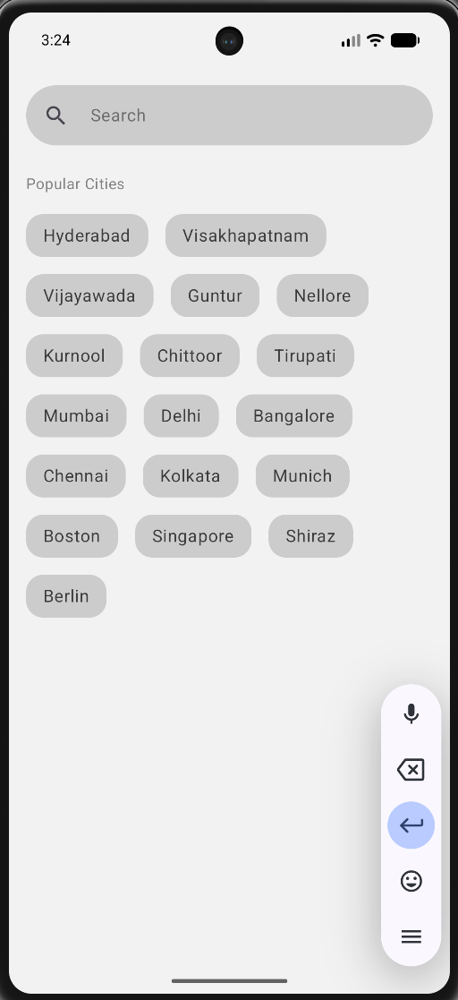
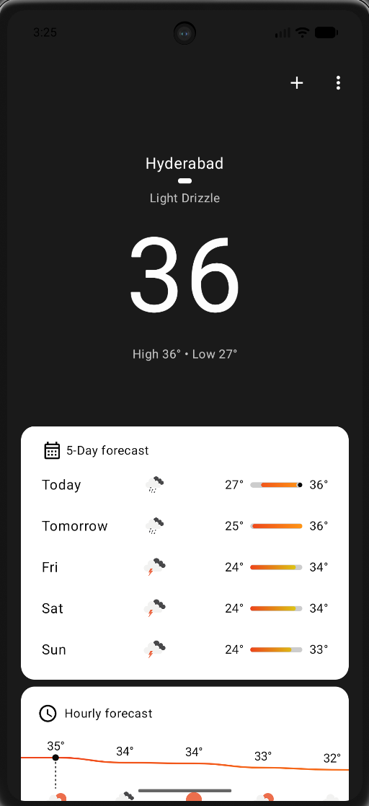
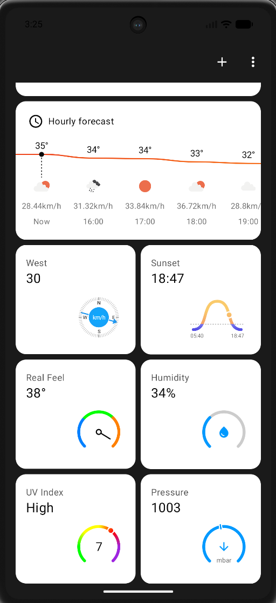
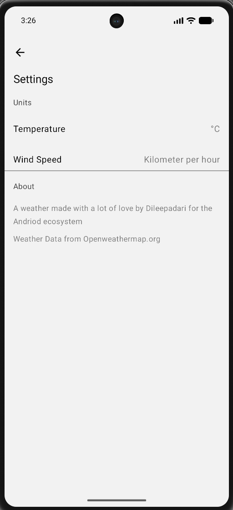
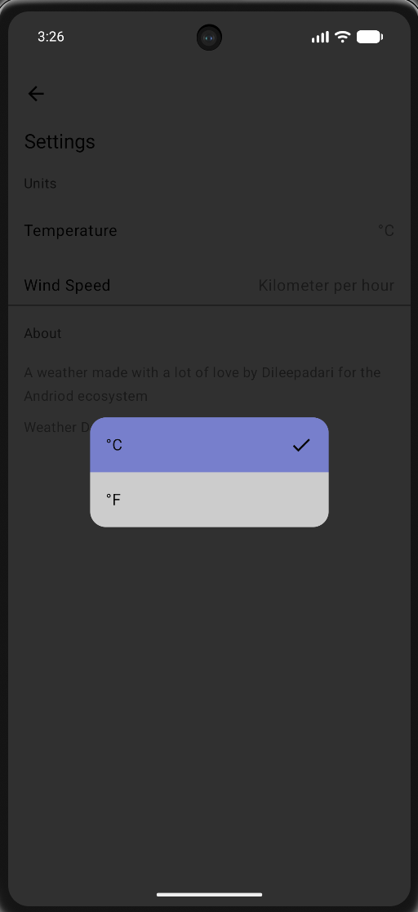
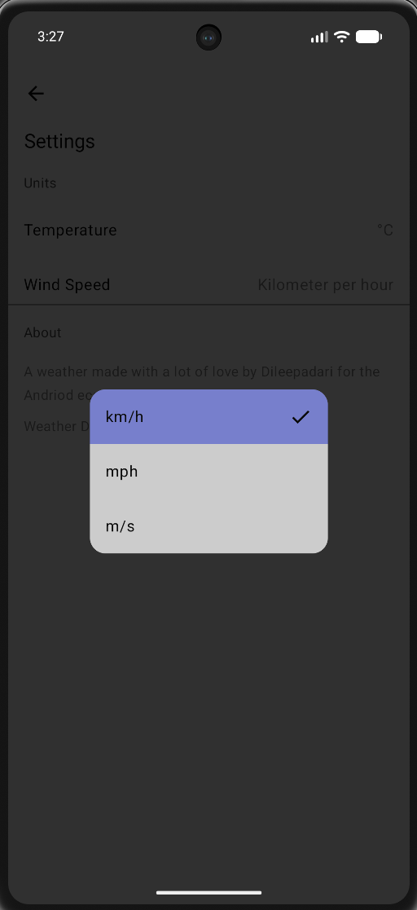

<div align="center">

<picture>
  <source media="(prefers-color-scheme: dark)" srcset="./docs/assets/adk_dev_logo_light.png">
  
</picture>

# MyWeather

**A beautiful, modern, and fully functional Android Weather application built entirely with Kotlin and Jetpack Compose.**


<br>


<br>

[](https://github.com/Dileepadari/MyWeather/actions/workflows/ci.yml)

**[Developer documentation](./DEVDOC.md)** &middot; [Screens](#screens) &middot; [Getting started](#getting-started)

</div>

---

## Overview

This project serves as a showcase for modern Android development practices, following an **offline-first** architecture and utilizing the latest Jetpack libraries. It features real-time weather tracking, background synchronization, and a fully customizable user interface.

---
## Features

- **Real-time Weather Data**: Get up-to-date current weather conditions.
- **Detailed Forecasts**: View detailed hourly and 5-day weather forecasts.
- **Location Search**: Search and add multiple cities to keep track of their weather.
- **Advanced Metrics**: View detailed metrics such as Wind Speed & Direction, UV Index, Humidity, Pressure, and Visibility.
- **Customizable Settings**: Tailor the app to your preferences by choosing your preferred Temperature units (Celsius/Fahrenheit) and Wind Speed units.
- **Offline First**: Weather data is cached locally using Room, so you can view the latest fetched data even without an active internet connection.
- **Background Sync**: Uses WorkManager to fetch and update weather data in the background.

## Screens

Captured on a device.

| Search Location | Home (Overview) | Home (Details) |
| :---: | :---: | :---: |
|  |  |  |

| Settings | Temperature Unit Selection | Wind Speed Unit Selection |
| :---: | :---: | :---: |
|  |  |  |

## Architecture and tech stack

This project leverages a multi-module **hybrid architecture** (by layer + by feature) for great scalability and separation of concerns:
* `app`: Primarily manages navigation logic and application-level wiring.
* `feature:*`: UI code and navigation setup for each individual page (Home, Search, Settings, etc.).
* `core:*`: Separate modules for networking, offline cache, models, design system, and shared code across the application.
* `sync:*`: Background synchronization logic using WorkManager.

### Technologies Used
* **UI**: [Jetpack Compose](https://developer.android.com/jetpack/compose)
* **Database**: [Room Database](https://developer.android.com/training/data-storage/room)
* **Networking**: [Ktor](https://ktor.io/)
* **Serialization**: [Kotlinx.Serialization](https://kotlinlang.org/docs/serialization.html)
* **Dependency Injection**: [Dagger Hilt](https://dagger.dev/hilt/)
* **Background Work**: [WorkManager](https://developer.android.com/topic/libraries/architecture/workmanager)
* **Build System**: Gradle Kotlin DSL with Convention Plugins (AGP 9.0+)

## Getting started

**No JDK or Android SDK version needs installing by hand.** Gradle provisions its own daemon JVM
(21) from `gradle/gradle-daemon-jvm.properties` and downloads the project toolchain (17) through
the foojay resolver configured in `settings.gradle.kts`. You do need an Android SDK.

1. **Clone the repository:**
   ```bash
   git clone https://github.com/Dileepadari/MyWeather.git
   ```
2. **Open in Android Studio:**
   Open Android Studio and select `File > Open`, then choose the cloned directory.
3. **API configuration:**
   The app uses the [Open-Meteo API](https://open-meteo.com/), which requires **no API key** for non-commercial use! The `BASE_URL` and required parameters are already safely configured in `secrets.default.properties` using the Gradle Secrets Plugin.
4. **Build and run:**
   - Wait for Gradle to finish syncing.
   - Select an emulator or connect a physical device.
   - Press Run in Android Studio, or run `./gradlew assembleDebug` from the command line.

## Static analysis and git hooks

- **Static Analysis**: The project uses **Detekt** and **Kotlinter** to enforce styling and catch code smells. You can configure Detekt via `config/detekt/config.yml` and Kotlinter via `.editorconfig`.
- **Git Hooks**: To enable pre-commit and pre-push checks, copy the scripts found in `git-hooks/*.sh` to your local `.git/hooks` directory.

## License

This project is distributed under the terms of the **Apache License (Version 2.0)**. See the [LICENSE](LICENSE) file for more information.
